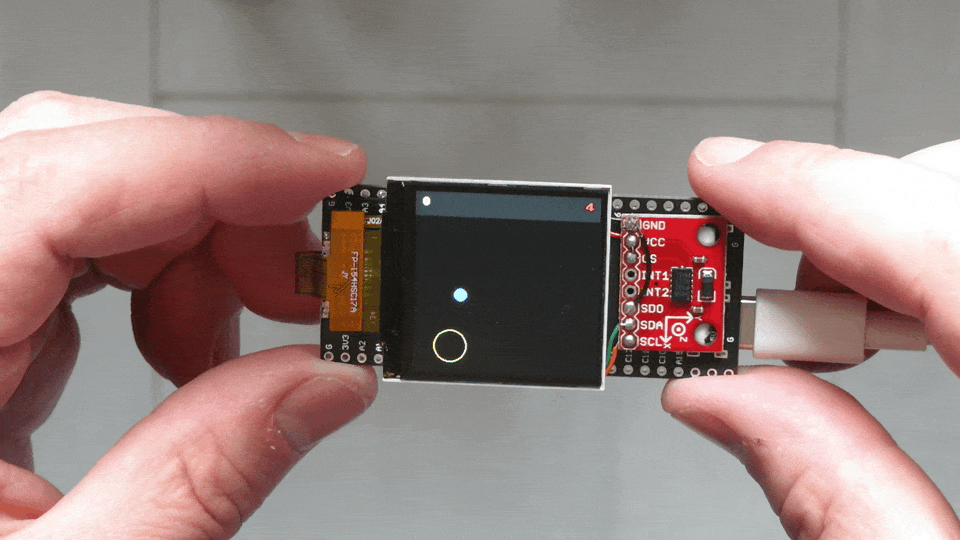
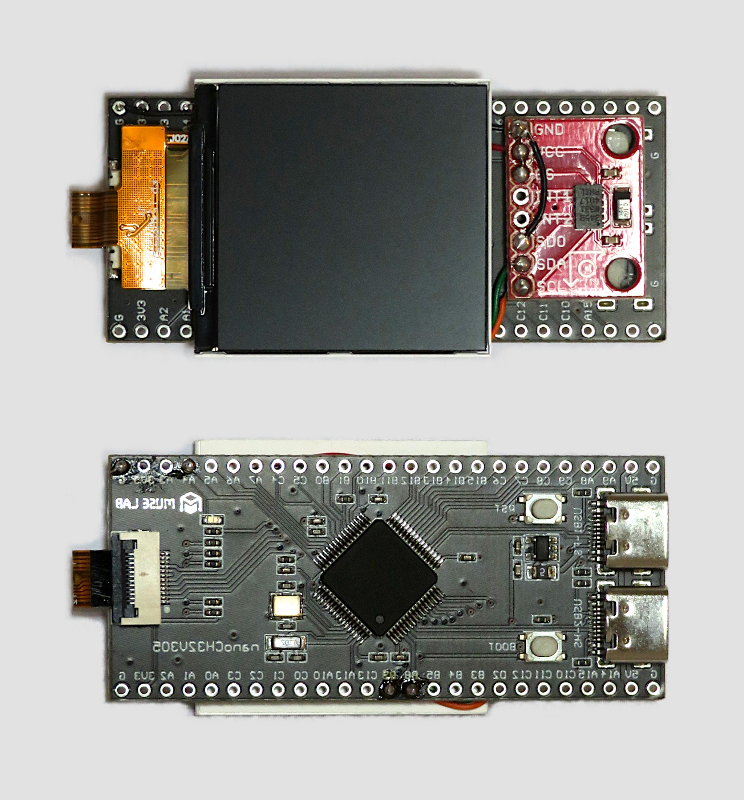

# Ball in a maze

Usa l'architettura [RISC-V](https://riscv.org/) su una [scheda di sviluppo e prototipazione](https://www.tindie.com/products/johnnywu/nanoch32v305-development-board) per il microcontrollore [CH32V305](https://wch-ic.com/products/CH32V307.html), un display LCD da 240x240 pixel con controller ST7789, una [breakout board accelerometro](https://www.sparkfun.com/products/9836) a 3 assi [ADXL345](https://www.analog.com/en/products/adxl345.html) e la toolchain [GCC](https://gcc.gnu.org/) per implementare un gioco basato sull'equilibrio e il bilanciamento fisico della scheda stessa.

